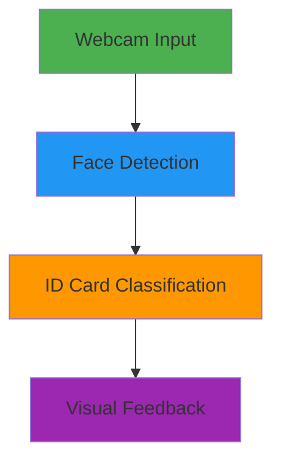

# 🎓 Student ID Card Detection using Machine Learning

<div align="center">
  
</div>

## 📌 Project Overview

This project demonstrates a **computer vision system** that detects whether a person is wearing their student ID card using:
- **Deep Learning** (MobileNetV2 transfer learning)
- **Face Detection** (Haar Cascades)
- **Real-time Webcam Processing**



## 🚀 Key Features

- **Real-time Detection**: Processes webcam feed at ~10 FPS
- **Two-Class Classification**:
  - ✅ Wearing ID
  - ❌ No ID
- **Visual Feedback**: Color-coded bounding boxes (Green=ID, Red=No ID)
- **Dataset Processing**: Includes automated validation and conversion scripts

## 🛠️ Technical Implementation

### Model Architecture
```python
base_model = MobileNetV2(include_top=False, input_shape=(224,224,3))
x = base_model.output
x = Flatten()(x)
x = Dense(128, activation='relu')(x)
x = Dropout(0.5)(x)
output = Dense(2, activation='softmax')(x)
```

### Performance Metrics
| Metric        | Training | Validation |
|---------------|----------|------------|
| Accuracy      | 93.8%    | 93.3%      |
| Loss          | 0.34     | 0.36       |

## 🖥️ System Requirements

- Python 3.8+
- TensorFlow 2.x
- OpenCV 4.x
- Webcam

## ⚡ Quick Start

1. **Install dependencies**:
   ```bash
   pip install tensorflow opencv-python pillow numpy
   ```

2. **Run the detection system**:
   ```bash
   python source code.ipynb
   ```

3. **Interact with the system**:
   - Press 'q' to quit
   - Face the camera to see real-time detection

## 📂 Project Structure

```
student-id-card-detection/
├── dataset/                  # Training/validation data
│   ├── train/
│   └── validation/
├── id_card_detection_model.h5  # Pretrained model
├── data_processing/          # Dataset preparation scripts
│   ├── split_dataset.py
│   ├── validate_images.py
│   └── convert_webp.py
└── source code.ipynb     # Main application
```

## 🎨 Sample Output

<div align="center">
  
   
</div>

## 📈 Future Enhancements

- [ ] Add audio feedback
- [ ] Improve model for side-profile faces
- [ ] Deploy as web application
- [ ] Add liveness detection

## 🤝 Contributing

Contributions welcome! Please:
1. Fork the repository
2. Create your feature branch
3. Submit a pull request

---

<div align="center">
  
  <p>Happy coding! 👨‍💻</p>
</div>
```


